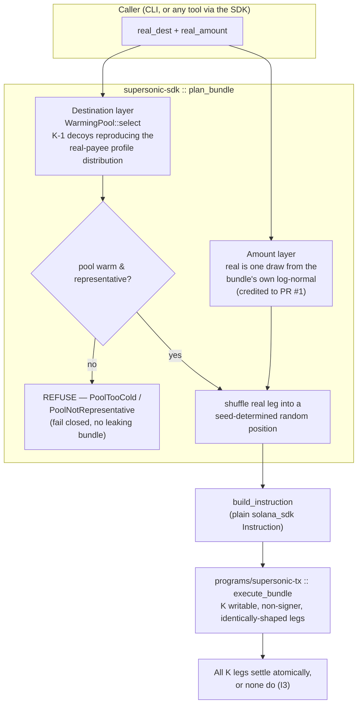

# supersonic-tx

[](https://github.com/gustavo-f0ntz/supersonic-tx/actions/workflows/ci.yml)

**A channel-complete decoy system for Solana transfers.** Hide which of K legs in an
atomic bundle is the real payment — by matching the real leg in *every* observable
channel, not just the amount.

Superteam Brasil "Privacy-Through-Noise" bounty submission. Standalone, Rust-only,
non-custodial.

## The one-paragraph pitch

A bundle's legs expose two things: **amount** and **destination**. Prior work
([@Jmkoygg's PR #1](https://github.com/solanabr/supersonic-tx/pull/1)) closes the amount
channel well but leaves destinations as fresh keys with zero history — while **63.4% of
real mainnet transfer destinations already have on-chain history** (n=1181, measured).
One `getSignaturesForAddress` per leg turns that gap into a **+0.60 advantage at K=16 —
roughly 50× the amount-channel advantage**. This system closes that channel with a
pre-warmed decoy pool whose history profile is drawn from the same distribution as real
payees, fails closed when it can't match, and **measures** the residual it cannot close (the
funding graph). It is the 2017→2018 Monero decoy-selection lesson, ported to Solana.

## How a bundle gets built



An on-chain observer sees `settle`'s K legs — same instruction shape, same account
role, amounts and destinations each drawn from one indistinguishable distribution
(`CHANNELS.md §3`) — and cannot tell which one was `intent`.

## Read in this order

1. **[DESIGN.md](DESIGN.md)** — the thesis, the measurement, the defense, and where it stops.
2. **[PROOF.md](PROOF.md)** — reproducible evidence: every number, one command each.
3. **[CHANNELS.md](CHANNELS.md)** — channel-by-channel status, closed and open, and the crowd interface the open residual needs.
4. **[COMPOSABILITY.md](COMPOSABILITY.md)** — an independent binary casting through the deployed router using only the published SDK, settled on real devnet.

## Layout

```
programs/supersonic-tx   atomic K-leg transfer router (non-custodial, atomic, recoverable)
supersonic-sdk           bundle planner: amount layer (exchangeable, credited to PR #1)
                         + destination layer (matched pre-warmed pool)  ← the contribution
cli  (supersonic)        warm / plan / inspect / recover (offline) + send (simulates
                         by default; --broadcast to submit to an RPC)
dest-harness             destination-channel adversary + advantage measurement
e2e                      SDK-planned bundle settles on the real program in LiteSVM
composability-demo       independent binary, SDK-only dependency, real devnet proof
```

## Quickstart

```bash
# 1. build the program artifact the e2e tests load by path (needs the Solana toolchain)
cargo build-sbf --manifest-path programs/supersonic-tx/Cargo.toml

# 2. everything, one command — 68 tests across all six crates
cargo test --workspace
#   (step 1 is required first: the 8 e2e tests load the .so and fail loudly,
#    with a "run cargo build-sbf" message, if it isn't built)

# reproduce the headline measurement (real mainnet data, in-repo)
cd dest-harness
cargo run -p supersonic-dest-harness --bin dest-advantage -- \
    --study data/dest_study.jsonl --n 8000 --seed 1

# the CLI (warm/plan/inspect/recover are offline; send simulates unless --broadcast)
cargo run -p supersonic-cli -- --help
```

## Casting through it from another tool

Composability is a **library dependency, not a wire format**: there is no service to run and
no custody handoff. A caller plans a bundle and gets back a plain `solana_sdk::Instruction`
to drop into whatever transaction it was already building.

```rust
let plan = plan_bundle(&seed, bundle_id, real_dest, real_amount, &pool, 8, cfg)?;
let ix = build_instruction(program_id, payer, &plan);   // → your tx builder
```

The full working version is the [module doctest in `supersonic-sdk`](supersonic-sdk/src/lib.rs)
— CI runs it, so this integration path is tested, not asserted. `composability-demo/` takes
it further: a **separate binary**, its own `Cargo.toml`, depending only on the published
`supersonic-sdk` crate, that planned and **broadcast a real bundle on devnet**
([tx](https://explorer.solana.com/tx/KAP8cfKvRyqV8f5PXe58LrFnJSCbrqWhHbqiJca7fRtfaYUcHqyjr2wYVuTvWnAuethT565iNYqBg7FFdRYxSNw?cluster=devnet)).
See [COMPOSABILITY.md](COMPOSABILITY.md).

**On `account-cooker`:** the relationship runs both ways. A cooker's job is manufacturing
believable long-lived account histories, which is exactly what a warmed pool member must be
— so a cooker can *be* the warming layer here, and cast its own funding and consolidation
transfers through this program. PR #1 named "a companion account-cooker" as the hypothetical
mitigation for the destination channel; this repo is the half that consumes it, with the
interface (`WarmingPool` / `PoolMember`) and the measurement that says when a pool is warm
enough to be safe — and refuses when it isn't.

## What it does not claim

The defense closes the destination-history channel to a measured floor (~+0.01 at K=16
against the best linear attack, via the deployed selection path, the same order as PR
#1's amount-channel floor; +0.09 against a nonlinear ensemble — still 4–7× below the open
channel, explained in `PROOF.md §2.3`). It does **not** close funding provenance:
a decoy funded by the signer re-links one hop out, so a third-party-funded real payee still
stands out. We measured it — for durable P2P payees, **86.5% are third-party-funded, a
residual of +0.27–0.51** (`PROOF.md §6`) that no self-funded decoy scheme can close; only
decoys funded by unlinkable third parties (a crowd) can. (Most *raw* transfer destinations,
though, turn out to be self-funded transient token accounts a decoy already matches — the
residual is a property of who you actually pay, not the transfer population at large.) See
[CHANNELS.md §5](CHANNELS.md).

**Deployed on devnet** — [program `D1yahocVjdQFeidzSwsEeWBYF3ePvjpmjPJjKHHaY9be`](https://explorer.solana.com/address/D1yahocVjdQFeidzSwsEeWBYF3ePvjpmjPJjKHHaY9be?cluster=devnet),
with a real CLI-planned bundle settled on chain ([tx](https://explorer.solana.com/tx/5zd9D1V51Grjjm9tB38jimgdAHwAb3n5s4gqgwYUQgx5FMoygJpKKkEhVciZCNGS56NVxZJKNDsq65ADw8GtojjR?cluster=devnet), status Ok). See [PROOF.md §4.1](PROOF.md).

## Credit

The exchangeable amount construction is [@Jmkoygg](https://github.com/solanabr/supersonic-tx/pull/1)'s;
we reimplement it with attribution as our amount layer. The destination layer, harness,
program, CLI, and the mainnet payee-profile dataset are ours.
